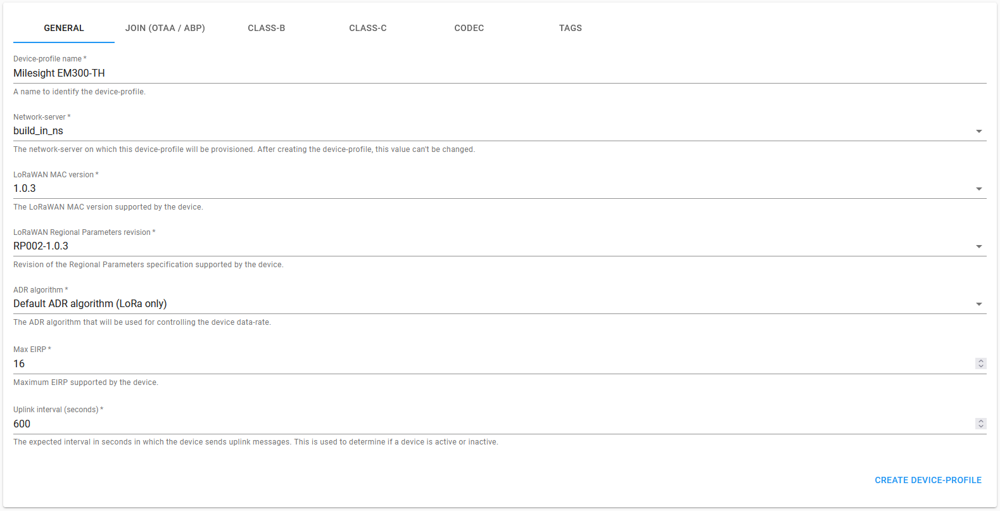

Salut

# EnergyAIM

Création de Dashboard avec des outils connectés aux différents appareils
d’un ou plusieurs bâtiments. Analyse, support, engineering, supervision
d’installations, maintenance préventive, chasse au gaspillage sont
les principales compétences que nous pouvons mettre à disposition
pour tout domaine de chauffage, ventilation et gestion de l’eau.

***

## Processus

| Process Name | Port |
| ------------ | ---- |
| Grafana Dashboard | 3000 |
| Chirpstack Application Server | 8080 |
| Prometheus | 9090 |
| Node Exporter | 9100 |
| Chirpstack Exporter | 9200 |
| Shelly Exporter | 9300 |
| Portainer | 9443 |

***

## Sommaire
1. [Pré-requis](#pré-requis)
2. [Installation](#installation)
3. [LoRaWAN Sensors avec Chirpstack](#lorawan-sensors-avec-chirpstack)
4. [Erreurs connues](#erreurs-connues-avec-correctifs)

***

## Pré-requis

### Hardware
- [ ] Raspberry Pi 4B 2G (ou similaire)
- [ ] [IoT LoRa Gateway HAT for Raspberry Pi](https://www.pi-shop.ch/iot-lora-gateway-hat-for-raspberry-pi-868mhz-915mhz)
- [ ] Support SSD (recommandé)
- [ ] Boîter pour Raspberry + HAT ([fichiers 3D](case))
- [ ] Ventilateur 5V DC
- [ ] Câble alimentation Raspberry Pi
- [ ] Câble Ethernet

### On-Site
- [ ] Accès au réseau LAN via Ethernet
- [ ] Prise pour alimentation du Raspberry Pi

### Capteurs
- [ ] **LoRaWAN**
    - ELSYS
    - Milesight
    - Dragino
- [ ] **Online API** 
    - Shelly
    - Danfoss
- [ ] *LAN Modbus TCP (à venir)*    


***

## Installation

### 1. Installer l'image Raspian sur le SSD à l'aide de Raspberry Pi Imager

### 2. Autoriser la connection au Raspberry via SSH

### 3. Définir une adresse IP fixe :
    
```
sudo nano /etc/dhcpcd.conf
```

Ajouter les lignes suivantes à la fin du fichier :

```
interface eth0
static ip_address=<ip_adress>/24
static routers=<router_address>
```   
Redémarrer le Raspberry Pi
```
sudo reboot
```       
### 4. Installer la passerelle LoRaWAN

[Git de la passerelle](https://github.com/RAKWireless/rak_common_for_gateway)
    
Installer les éléments suivants :

```
sudo apt update; sudo apt install git -y
```
```
git clone https://github.com/RAKWireless/rak_common_for_gateway.git
```
```
cd rak_common_for_gateway
```
Changer la PIN de reset du SX1301
```
sudo nano lora/start.sh
```
Remplacer la valeur `17` par `22`
```
SX1301_RESET_BCM_PIN=22
```
Lancer l'installation
```
sudo ./install.sh
```
Sélectionner le n° **5** RAK2247(SPI)

[*Erreurs possibles lors de l'installation*](#erreurs-connues-avec-correctifs)

La console affiche ceci en cas de succès :
```
*********************************************************
*  The RAKwireless gateway is successfully installed!   *
*********************************************************
```
Redémarrer le Raspberry Pi

    sudo reboot

Pour configurer la passerelle, exécutez la commande suivante :

    sudo gateway-config

### 5. Installer Docker

Les différents services de communications sont implémentées sur des Dockers. Cela permet de les manager et de pouvoir les tracer en cas de dysfonctionnement.

Télécharger le script d'installation :

    curl -fsSL https://get.docker.com -o get-docker.sh

Exécutez le script

    sudo sh get-docker.sh

Supprimer le script

    sudo rm get-docker.sh


### 6. Connection SSH de puis l'extérieur avec **tmate**

 1. Installer tmate

        sudo apt-get install tmate

 2. Modifier le fichier de configuration :

        sudo nano ~/.tmate.conf

    Ajouter ceci : (API key GAP)

        set tmate-api-key "tmk-0tzBJJMOLS6CjecX4RcA0WC0k9"
        set tmate-session-name "<generer_une_chaine_unique>"
    
 3. Créer le service :    

        sudo nano /etc/systemd/system/tmate.service

    Ajouter le code suivant :

        [Install]
        WantedBy=multi-user.target

        [Unit]
        Description=Tmate-SSH
        Wants=network-online.target
        After=network-online.target

        [Service]
        Type=simple
        Restart=always
        User=pi # (utilisateur)
        ExecStart=tmate -F


    Puis lancer le service :

        sudo systemctl enable tmate.service && sudo systemctl start tmate.service

 4. Obtenez les liens :

        sudo systemctl status tmate.service


### 7. Partager une addresse avec [tunnel.pyjam.as](https://tunnel.pyjam.as/)  
    
 1.     sudo apt-get install wireguard-tools
 
 2.     sudo curl https://tunnel.pyjam.as/<port> > tunnel.conf && sudo wg-quick up ./tunnel.conf

    Pour quitter :

        sudo wg-quick down ./tunnel.conf

***

## LoRaWAN Sensors avec Chirpstack

### Connection à la plateforme via navigateur

Se rendre sur l'adresse `http://<raspberry_ip>:8080`

Les identifiants par défaut sont :
    
    user : admin
    password : admin   

### Créer une `Application`

### Créer les `Devices-profiles` nécessaires en rapport avec les capteurs à disposition :

**Onglet GENERAL**



**Onglet JOIN (OTAA / ABP)**

- [x] Device supports OTAA
 
**Onglet CODEC**

`Payload codec` : `Custom JavaScript codec functions`
    
Cet onglet permet de définir un script afin de décoder les données reçues du capteur.

Copier le code du modèle de capteur correspondant depuis le dossier [chirpstack/sensors_decoders](chirpstack/sensors_decoders).

### Ajout des capteurs (Devices)
- Créer les `Devices` depuis l'onglet `Applications`.
- Renseigner les informations du capteur
- Le `Device EUI` se trouve en principe noté sur le capteur
- Renseigner l'`Application key`, en principe modifiable sur la configuration du capteur.


### Ajouter l'intégration http

Allez sous l'application à intégrer, dans l'onglet `INTEGRATIONS`.
Cliquez sur `Add HTTP integration`.

- Payload marshaler : JSON
- Endpoint : http://localhost:9200

Chirpstack va envoyer automatiquement les données sur cette adresse via des requêtes POST.


***

## Portainer

Portainer est une interface Web (WebUI) open source qui permet de créer, modifier, redémarrer, surveiller… des conteneurs Docker. Le petit plus de l’outil, c’est également de pouvoir interconnecter plusieurs serveurs utilisant Docker (via Portainer Agent), afin de contrôler/surveiller les conteneurs répartis sur plusieurs serveurs depuis la même interface et cela très simplement.

### Installation

Créer le volume :

    sudo docker volume create portainer_data

Lancer le docker :

    sudo docker pull portainer/portainer-ce:latest

    sudo docker run -d -p 8000:8000 -p 9443:9443 --name=portainer --restart=always -v /var/run/docker.sock:/var/run/docker.sock -v portainer_data:/data portainer/portainer-ce:latest


Accéder à l'interface de Portainer sur https://<raspberry_ip>:9443  

***

## Prometheus

Prometheus est un logiciel open source créé par la plateforme musicale SoundCloud, conçu pour monitorer les métriques de fonctionnement des serveurs et créer une gestion d’alertes en fonction de seuils considérés critiques. Cet outil de monitoring enregistre en temps réel ces données à l'aide d'un modèle d'extraction de endpoints HTTP.
    
    sudo docker volume create prometheus_data


***

## Chirpstack Exporter


    cd chirpstack_exporter

    sudo docker build -t chirpstack_exporter .
    
Cette commande peut prendre plusieurs dizaines de minutes.


***

## Erreurs connues avec correctifs

- [Installation de la passerelle LoRaWAN](#installation-de-la-passerelle-lorawan)

- [Problèmes Raspberry Pi](#problèmes-raspberry-pi)

***

### Installation de la passerelle LoRaWAN

#### **Could not resolve host: github.com**

Solution : Configurer le fichier `interfaces`

    sudo nano /etc/network/interfaces

Ajouter à la fin du fichier :

    dns-nameservers 8.8.8.8

Relancer le service :

    sudo systemctl restart systemd-resolved.service

#### **Pas de service Chirpstack sur le Raspberry**

Solution : Relancer l'installation mais en sélectionnant le n° **4** RAK2247(USB)

    sudo nano ./install.sh

***    

### Problèmes Raspberry Pi

#### **Fuites de mémoire RAM**

Solution : Désactivez le service display-manager